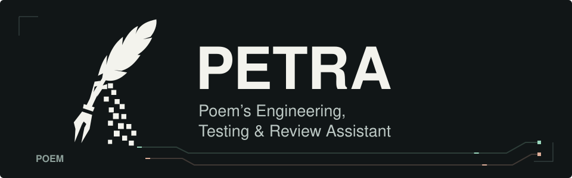
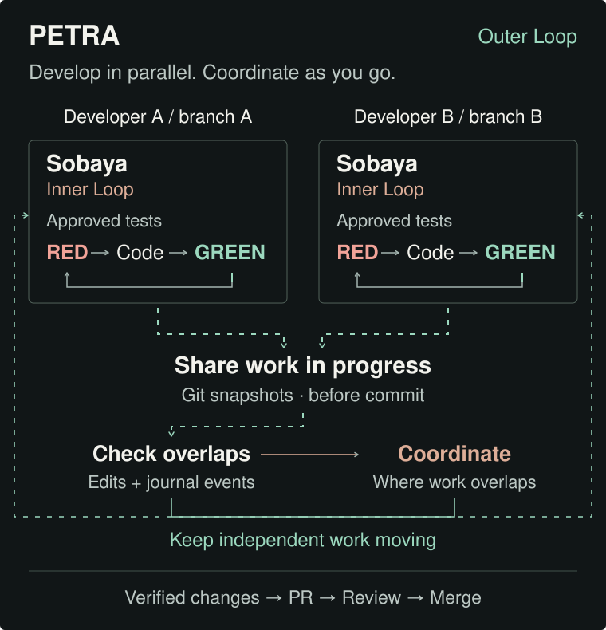

<div align="center">
  
</div>

# PETRA · 페트라

Poem 팀의 Agentic Coding 협업 개발 도구입니다. 서로의 진행 상황을 파악하고 겹치는 변경을 일찍 조율해, 충돌을 줄이며 병렬로 개발하도록 돕습니다.
코드를 작성하는 동안 각 에이전트가 작업 목표, 편집 중인 파일, 중요한 변경을 공유합니다.

**한국어** | [English](README.en.md)

## 팀원과 작업을 공유하고 조율하기

PETRA는 팀의 협업을 맡는 **Outer Loop**, [Sobaya](https://github.com/team-poem/sobaya)는 그 안에서 코드 작성과 검증을 맡는 **Inner Loop**입니다. 각자의 Inner Loop가 도는 동안, Outer Loop에서는 작업 상태를 수시로 주고받습니다.

<div align="center">
  
</div>

- **작업 중인 내용 공유.** 각자의 브랜치에서 개발하면서 커밋 전 변경을 스냅샷으로 주고받습니다. 작업 목표와 저널도 함께 읽어 동료가 무엇을 하고 있는지 파악합니다.
- **충돌할 부분을 미리 확인.** 같은 파일을 편집하거나 내 코드에 영향을 주는 변경이 있으면 알려줍니다. 스키마 같은 중요한 공용 파일은 동시 편집이 확인되면 수정을 멈추고 조율합니다.
- **조율이 필요한 곳을 탐색.** 겹치는 변경은 작업 범위나 순서를 정하고, 독립적인 작업은 각자 이어갑니다. 검증한 변경은 작은 커밋과 PR로 합칩니다.

공유에는 팀의 Git 원격을 사용하며, 별도 서버는 필요하지 않습니다. 팀이 공유한 정보와 나의 현재 상태를 기준으로 에이전트가 충돌을 판단하며, 모든 충돌을 막는 실시간 잠금은 아닙니다.

### Sobaya

코드 작성에는 기본적으로 Sobaya를 사용합니다. 승인된 테스트를 기준으로 실패를 확인하고, 구현과 검증을 반복하는 TDD 기반 개발 도구입니다.
개발 루프에 대한 자세한 내용은 [Sobaya README](https://github.com/team-poem/sobaya#readme), PETRA에서 연결하는 방법은 [연동 안내](docs/petra-sobaya.md)를 참고하세요.

## 시작하기

Git, jq, Node.js 22 이상이 필요합니다. 설치할 프로젝트는 초기 커밋이 있는 Git 저장소여야 하며, main이 아닌 **변경 사항이 없는 작업 브랜치**에서 시작합니다.

```sh
git clone --depth 1 --branch v0.1.0 https://github.com/team-poem/petra.git
cd petra

# 프로젝트에 적용할 변경을 먼저 확인합니다.
sh bin/petra install --target /path/to/project --dry-run

# 출력된 plan_id를 넣어 확인한 변경을 적용합니다.
sh bin/petra install --target /path/to/project \
  --apply --expect-plan <plan_id>
```

앱 코드와 README는 그대로 두고, PETRA의 실행 파일과 협업 기록은 `.petra/`에 설치합니다.
설치 변경을 검토해 커밋한 뒤, 각 팀원이 프로젝트에서 자신의 핸들로 합류합니다.

```sh
cd /path/to/project
sh .petra/bin/petra join <your-handle>
```

이어서 [Sobaya를 연결](docs/petra-sobaya.md)하면 개발을 시작할 수 있습니다. 자세한 설치 과정은 [설치 안내](docs/petra-install.md)에 있습니다.
먼저 동작을 살펴보려면 [리포 안의 테스트 환경](docs/petra-lab.md)을 사용하세요.

> 작업 스냅샷에는 아직 커밋하지 않은 파일 내용도 포함됩니다. 비밀 키나 로컬 전용 파일은 공유 전에 `.gitignore`로 제외하세요.

## 문서

- [협업 흐름](docs/guide.md) · 실제 작업에서 PETRA 사용하기
- [작업 중 공유](docs/petra-sharing.md) · 스냅샷, 저널, 체크포인트
- [업데이트와 이전](docs/petra-lifecycle.md) · 버전 변경, 이전, 복구
- [구조와 명령](docs/reference.md) · CLI, 기록 형식, 훅
- [기여 안내](CONTRIBUTING.md) · 개발 절차와 테스트
- [AGENTS.md](AGENTS.md) · 이 저장소에서 작업하는 에이전트의 규칙
